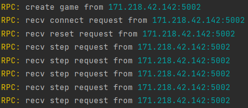
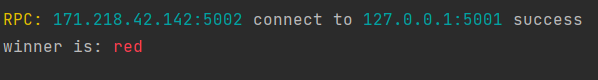

# pop-shark
a simple microservice platform of amazon chess based on grpc,and create it by library: `github.com/murInJ/amazonsChess`

## contributor
MurInJ

## function

## install
```shell
go get github.com/murInJ/pop-shark
```
## quick start
before use pop-shark, please confirm you have library `github.com/murInJ/amazonsChess`

first start a rpc server:
```go
//server
server := pop_shark.NewChessServer("5001")
server.Start()
```
if receive request,you will see follows

then we can play game by amazonsChess on client

```go
//client

client, _ := pop_shark.NewChessClient("5002", "127.0.0.1:5001")

game, _ := amazonsChess.NewGame(1)
err = game.Reset(game.CurrentPlayer)
state, _ := client.Reset(-1)
game.CurrentState = state

for {
    valid := game.CurrentState.GetValid()
    rand.Seed(time.Now().Unix()) //产生Seed
    move := valid[rand.Intn(len(valid))]
    status, m, _ := client.Step(move)

    if status == 3 {
      game.Winner = int(m["winner"].(float64))
	  var playerStr string
	  if game.Winner == 1 {
        playerStr = color.New(color.FgHiRed).Sprintf("red")
	  } else {
		  playerStr = color.New(color.FgHiBlue).Sprintf("blue")
        }
		fmt.Printf("winner is: %s\n", playerStr)
	  break
    }
    game.CurrentState = pop_shark.Map2state(m)
}
_ = client.Close()
```
